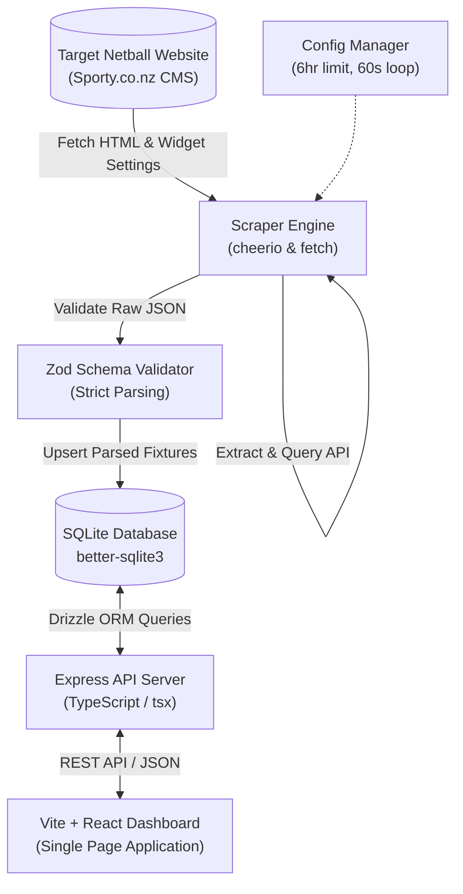

# Project Specification: Netball Score Tracker

## 1. System Overview & Architecture
The Netball Score Tracker is a lightweight, self-contained application that scrapes netball match draws and results, persists them to a local SQLite database, and exposes a real-time web dashboard.

### System Architecture Diagram


### End-to-End Data Flow
1. **Target Website Fetching:** The system retrieves the HTML page of the target URL to extract dynamic Sporty widget parameters (e.g., `CompIds`, `OrgIds`, `GradeIds`).
2. **Scraper Engine:** Hits the internal Sporty JSON endpoint `/api/v2/competition/widget/fixture/DatesNoCache` directly, bypassing fragile HTML scraping.
3. **Zod Parser:** Raw JSON results are validated at the runtime boundary, ensuring strict types.
4. **Database Persistence:** Validated records are upserted into the SQLite database. Duplicate records are detected and updated via conflict resolution logic.
5. **API Server:** An Express HTTP server exposes endpoints to read scores, list teams, and control scraper settings (e.g., start, stop, configure interval).
6. **Browser UI:** A modern dashboard built using Vite, React, and CSS variables displays scores for selected teams and provides scraper control toggles.

---

## 2. Directory Layout
We use a clean, modular TypeScript layout. Both backend and frontend source files reside inside `/src`.

```
netball-scores/
├── package.json
├── tsconfig.json
├── SPEC.md
├── README.md
├── src/
│   ├── scraper/
│   │   ├── engine.ts           # Fetching scheduler and HTTP clients
│   │   └── config.ts           # Operational configurations (intervals, targets)
│   ├── parser/
│   │   ├── html-parser.ts      # HTML extracting of sporty widget settings
│   │   └── schemas.ts          # Zod schema definitions for fixtures & results
│   ├── db/
│   │   ├── index.ts            # better-sqlite3 database connection
│   │   ├── schema.ts           # Drizzle table schemas
│   │   └── repository.ts       # DB query/UPSERT functions
│   ├── api/
│   │   ├── server.ts           # Express server setup and routes
│   │   └── controller.ts       # Endpoint handlers (teams, scores, toggles)
│   ├── web/                    # React frontend application
│   │   ├── index.html
│   │   ├── src/
│   │   │   ├── main.tsx
│   │   │   ├── App.tsx
│   │   │   ├── index.css       # Clean premium CSS variable-based styling
│   │   │   └── components/     # UI components (TeamSelector, ScoreCard, ControlPanel)
│   │   └── vite.config.ts
│   └── types/
│       └── shared.ts           # Inferred TS types from Zod schemas
```

---

## 3. Data Contracts & Domain Models

### Zod Schema (`src/parser/schemas.ts`)
```typescript
import { z } from 'zod';

export const FixtureSchema = z.object({
  id: z.number(),
  compId: z.number(),
  gradeId: z.number(),
  gradeName: z.string(),
  roundName: z.string().optional().nullable(),
  dateFrom: z.string().datetime(), // ISO datetime string
  dateTo: z.string().datetime().optional().nullable(),
  homeTeamId: z.number(),
  homeTeamName: z.string(),
  awayTeamId: z.number(),
  awayTeamName: z.string(),
  venueName: z.string().optional().nullable(),
  homeScore: z.string().nullable().transform(val => {
    if (val === null || val === '') return null;
    const num = parseInt(val, 10);
    return isNaN(num) ? null : num;
  }),
  awayScore: z.string().nullable().transform(val => {
    if (val === null || val === '') return null;
    const num = parseInt(val, 10);
    return isNaN(num) ? null : num;
  }),
  statusName: z.string().optional().nullable()
});

export type Fixture = z.infer<typeof FixtureSchema>;
```

### Database Schema (`src/db/schema.ts`)
```typescript
import { sqliteTable, integer, text, index, uniqueIndex } from 'drizzle-orm/sqlite-core';

export const fixtures = sqliteTable('fixtures', {
  id: integer('id').primaryKey(), // Sporty internal match ID
  compId: integer('comp_id').notNull(),
  gradeId: integer('grade_id').notNull(),
  gradeName: text('grade_name').notNull(),
  roundName: text('round_name'),
  dateFrom: text('date_from').notNull(),
  dateTo: text('date_to'),
  homeTeamId: integer('home_team_id').notNull(),
  homeTeamName: text('home_team_name').notNull(),
  awayTeamId: integer('away_team_id').notNull(),
  awayTeamName: text('away_team_name').notNull(),
  venueName: text('venue_name'),
  homeScore: integer('home_score'),
  awayScore: integer('away_score'),
  statusName: text('status_name'),
  lastUpdated: integer('last_updated', { mode: 'timestamp' }).notNull()
}, (table) => ({
  homeTeamIdx: index('home_team_idx').on(table.homeTeamName),
  awayTeamIdx: index('away_team_idx').on(table.awayTeamName),
  dateIdx: index('date_idx').on(table.dateFrom)
}));
```

---

## 4. Operational Requirements & Resilience

### Rate Limiting & Politeness
- Network queries to the target domain (`sporty.co.nz`) are limited to **one** scraper check per iteration.
- Sequential fetches (HTML scrape -> API query) will include a polite `1000ms` sleep to prevent IP blocking.

### Retry Logic with Exponential Backoff
- Network errors (429, 5xx, timeouts) will undergo a maximum of **3 retry attempts**.
- Delay calculation: $Delay = BaseDelay \times 2^{attempt}$ (starting at `2000ms`).

### Deduplication (UPSERT Strategy)
- Using SQLite's `INSERT ... ON CONFLICT(id) DO UPDATE` ensures existing records are overwritten with the latest scores or fixture modifications (e.g. game cancellations or rescheduled times) without generating duplicates.

### Scraper Lifecycle Controls
- **Scrape Loop:** Executes every 60 seconds (configurable).
- **Auto-Shutdown:** An in-memory expiration timer stops the execution loop automatically exactly **6 hours** after it has been enabled.
- **Toggles:** Scraper state (running vs. idle) is managed via API HTTP requests, modifying the active state flags in-memory.

---

## 5. Scope Boundaries

### In-Scope
1. **Dynamic Target Discovery:** Scraper parses target HTML, detects widget configurations, and query parameters dynamically.
2. **Incremental Storage:** A local SQLite database caching all draws, fixtures, and scores.
3. **Scraper State API:** Start, stop, reset, and re-configure scraper parameters via endpoints.
4. **Lightweight Dashboard:** Filter fixtures by team, show scores, display active scraper status, and allow toggle controls.

### Out-of-Scope (Future Enhancements)
1. **User Authentication & Multi-tenancy:** Dashboard access is public for local network hosts.
2. **External Proxy Networks:** All fetches originate from the host server.
3. **Persisted Historical Logs:** Multi-year records beyond the current season configurations.

---

## 6. Phased Implementation Roadmap

### Phase 1: Scaffolding & Tooling Configuration
- Initialize npm and configure dependencies (`express`, `tsx`, `typescript`, `zod`, `better-sqlite3`, `drizzle-orm`, `cheerio`, `vite`, `react`).
- Set up DB migration directory and workspace rules.

### Phase 2: Core Data Contracts & Schemas
- Implement `src/parser/schemas.ts` and `src/db/schema.ts`.
- Set up migrations and run a local database initialization script.
- Build parser test suite to mock Sporty page output and verify Zod validations.

### Phase 3: Scraper Engine & Database Integration
- Implement the HTML parsing step to extract Sporty widget credentials.
- Build the fetch client with retry logic and the Drizzle upsert repository.
- Implement the in-memory scraper loop with the 6-hour auto-stop timer.

### Phase 4: API Endpoint & Dashboard UI
- Build Express controllers for querying database entries and changing configurations.
- Develop the Vite-React dashboard with clean styling, featuring:
  - Active scraper state display with a start/stop toggle.
  - Team search filter and historical/upcoming fixture scorecard layout.
- Verify end-to-end integration and create developer manuals.
